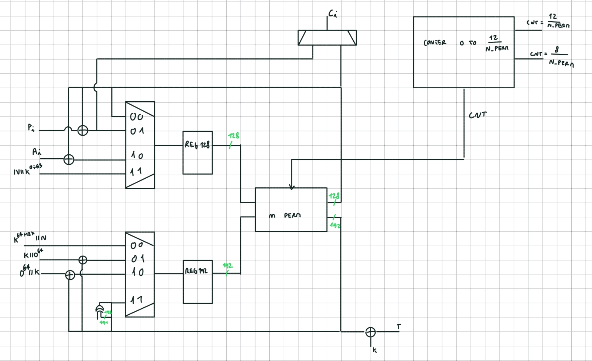

# ASCON

## Building the C reference model

```bash
git pull
git submodule init
git submodule update
mkdir build
cd build
cmake -S C -B build -DALG_LIST="asconaead128" -DIMPL_LIST="ref" -DTEST_LIST="genkat"
cmake --build build
ctest --test-dir build
```

Known Answer Tests results should be in `build/build/LWC_AEAD_KAT_128_128.txt`


## Using `ascon_enc_f` and `ascon_dec_f`

In order to be consistent with the official implementation, the key, nonce, associated data and plaintext need to be byte reversed, so, if the official python implementation provides this result:  

```
key:        0xabc5472b56742bca3675cbef47956338 (16 bytes)  
nonce:      0x2c66b325ae354f7804658cdfe43645af (16 bytes)  
plaintext:  0xfeb45ab41265432cde653dfeda543f4567565a (19 bytes)  
ass.data:   0x45bc627ad055be54fa4393fed679041245bc627ad055beb5fa4397fed9790ac234be6f12a08c (38 bytes)  
ciphertext: 0x6ba44ddc907dd8c3f87290fa64e5f1b8501cdd (19 bytes)  
tag:        0xe11a76b1067c168fde2a1bdddcad3258 (16 bytes)  
received:   0xfeb45ab41265432cde653dfeda543f4567565a (19 bytes)  
```

then, the inputs of the `ascon_enc_f` function will be:  

```
key_rev:        38639547EFCB7536CA2B74562B47C5AB  
nonce_rev:      AF4536E4DF8C6504784F35AE25B3662C  
plaintext_rev:  5A5667453F54DAFE3D65DE2C436512B45AB4FE  
ass.data_rev:   8CA0126FBE34C20A79D9FE9743FAB5BE55D07A62BC45120479D6FE9343FA54BE55D07A62BC45  
```

`ascon_enc_f` will then return the cyphertext and the Tag:  

```
t:          5832ADDCDD1B2ADE8F167C06B1761AE1  
ciphertext: DD1C50B8F1E564FA9072F8C3D87D90DC4DA46B  
```

So, `t` and `c` must be byte reversed again in order to be consistent with the results:  

```
tag_rev:        E11A76B1067C168FDE2A1BDDDCAD3258  
ciphertext_rev: 6BA44DDC907DD8C3F87290FA64E5F1B8501CDD  
```

`ascon_dec_f` will take as inputs: key, nonce, associated data and ciphertext. It's again needed to provide the reversed version of the original inputs, with the exception of ciphertext.  
So the inputs of `ascon_dec_f` will be:  

```
key_rev:        38639547EFCB7536CA2B74562B47C5AB  
nonce_rev:      AF4536E4DF8C6504784F35AE25B3662C  
ciphertext:     DD1C50B8F1E564FA9072F8C3D87D90DC4DA46B  
ass.data_rev:   8CA0126FBE34C20A79D9FE9743FAB5BE55D07A62BC45120479D6FE9343FA54BE55D07A62BC45  
```

`ascon_dec_f` will then return the plaintext and the Tag:  

```
t:          5832ADDCDD1B2ADE8F167C06B1761AE1  
plaintext:  5A5667453F54DAFE3D65DE2C436512B45AB4FE  
```

So they both need to be byte reversed:  

```
tag_rev:        E11A76B1067C168FDE2A1BDDDCAD3258  
plaintext_rev:  FEB45AB41265432CDE653DFEDA543F4567565A
```

In VHDL:

```vhdl
ad <= x"45bc627ad055be54fa4393fed679041245bc627ad055beb5fa4397fed9790ac234be6f12a08c";
pl <= x"feb45ab41265432cde653dfeda543f4567565a";
key <= x"abc5472b56742bca3675cbef47956338";
nonce <= x"2c66b325ae354f7804658cdfe43645af";

k_Rev <= reverse_byte(key);
n_rev <= reverse_byte(nonce);
ad_rev <= reverse_byte(ad);
pl_rev <= reverse_byte(pl);
	
T_enc <= reverse_byte(ascon_enc_f(k_rev,n_rev,ad_rev,pl_rev).t);
c_int <= ascon_enc_f(k_rev,n_rev,ad_rev,pl_rev).c;

T_dec <= reverse_byte(ascon_dec_f(k_rev,n_rev,ad_rev,c_int).t);
received <= reverse_byte(ascon_dec_f(k_rev,n_rev,ad_rev,c_int).p);

C <= reverse_byte(c_int);
```

## Using 32bit little endian CPU

Starting from the previous example, by writing key: 0xabc5472b56742bca3675cbef47956338 in little endian: 
```
Address | Byte Written
0x00    | 0x38
0x01    | 0x63
0x02    | 0x95
0x03    | 0x47
0x04    | 0xEF
0x05    | 0xCB
0x06    | 0x75
0x07    | 0x36
0x08    | 0xCA
0x09    | 0x2B
0x0A    | 0x74
0x0B    | 0x56
0x0C    | 0x2B
0x0D    | 0x47
0x0E    | 0xC5
0x0F    | 0xAB
```
So, by reading key starting from the lowest address, we would get: 0x38639547EFCB7536CA2B74562B47C5AB, which is already the correct format to be processed by the encryption.
Same for the Nonce.

The encryption will provide tag: 0x5832ADDCDD1B2ADE8F167C06B1761AE1, which written in little endian will become:
```
Address | Byte Written
0x20    | 0xE1
0x21    | 0x1A
0x22    | 0x76
0x23    | 0xB1
0x24    | 0x06
0x25    | 0x7C
0x26    | 0x16
0x27    | 0x8F
0x28    | 0xDE
0x29    | 0x2A
0x2A    | 0x1B
0x2B    | 0xDD
0x2C    | 0xDC
0x2D    | 0xAD
0x2E    | 0x32
0x2F    | 0x58
```
By reading it from address 0x20, it is already in the correct format.

## Axi_slave_write schematics

## Axi_slave_write state diagram

## Encryption hardware schematics

