# Masking of the ASCON cryptographic algorithm

## Index

- [Masking of the ASCON cryptographic algorithm](#masking-of-the-ascon-cryptographic-algorithm)
- [Building the C reference model](#building-the-c-reference-model)
- [Ascon package](#ascon-package)
- [The full architecture](#the-full-architecture)
- [Ascon_fsm](#ascon_fsm)
- [Axi_stream_slave](#axi_stream_slave)
- [Axi_stream_master](#axi_stream_master)
- [The AXI lite control interface](#the-axi-lite-control-interface)
- [Synthesis result](#synthesis-result)
- [ASCON on Zybo](#ascon-on-zybo)


Side-channel attacks exploit the power consumption or the electromagnetic emissions of hardware components during operations to retrieve embedded secrets, like secret keys, passwords, etc. Masking consists in randomizing computations to protect cryptographic operations against such attacks.
The goal of the project is to implement in VHDL a hardware accelerator for a cryptographic algorithm (ASCON), map it in a FPGA, and attack it. Then, a masked version will be designed, attacked and compared with the unprotected version. Finally, ways to automate the masking will be investigated.


# Building the C reference model

```bash
git pull
git submodule init
git submodule update
mkdir build
cd build
cmake -S C -B build -DALG_LIST="asconaead128" -DIMPL_LIST="ref" -DTEST_LIST="genkat"
cmake --build build
ctest --test-dir build
```

Known Answer Tests results should be in `build/build/LWC_AEAD_KAT_128_128.txt`

The C reference results will be used to test the encryption and decryption functions inside the Ascon package

# Ascon package
The file ascon_pkg.vhd contains the following functions (and procedures): 
- **single permutation functions**
  
  A single iteration of the Ascon algorithm is composed in 3 steps: Pc (constant addiction layer), Ps (substitution layer) and Pl (linear diffusion layer), each step is processed inside a function:
  - `ascon_pc_f`
  - `ascon_ps_f`
  - `ascon_pl_f`
  
  The 3 functions are jointed together inside the `ascon_p_f` function.

- **multiple permutations function**
  
  The `ascon_p_f_multiple` function is used to process multiple Ascon permutations, this will be used for the `ascon_enc_p` and `ascon_dec_p` procedures, aswell as the **crypto_core**.
  
  The ascon_p_f_multiple function is the hyerarchically highest function that will be used inside the synthesizable implementation of the Ascon algorithm, since it is still fully combinatorial.

- **byte reverse**
  
  The `reverse_byte` function is used to switch from big endian to small endian and vice versa. This function is needed to provide the proper input and output of the `ascon_enc_p` and `ascon_dec_p` procedure, aswell as the **crypto_core**.

- **encryption**
  
  The `ascon_enc_p` procedure processes the full Ascon encryption, considering all possible lenghts of Associated data and Plaintext

- **decryption**

  The `ascon_dec_p` procedure processes the full Ascon decryption, consdiering all possible lenghts of Associated data and Cyphertext

## In depth explanation of the `ascon_enc_p` procedure
```bash
procedure ascon_enc_p (key: in std_ulogic_vector; nonce: in std_ulogic_vector; ad: in std_ulogic_vector; pt: in std_ulogic_vector; ct: out std_ulogic_vector; tag: out w128_t) is

		constant a_len: natural := ad'length;
		constant a_local: std_ulogic_vector(a_len - 1 downto 0) := reverse_byte(ad);
		constant p_len: natural := pt'length;
		constant p_local: std_ulogic_vector(p_len - 1 downto 0) := reverse_byte(pt);
		constant k_len: natural := key'length;
		constant k_local: std_ulogic_vector(k_len - 1 downto 0) := reverse_byte(key);
		constant n_len: natural := nonce'length;
		constant n_local: std_ulogic_vector(n_len - 1 downto 0) := reverse_byte(nonce);
		constant iv: std_ulogic_vector(63 downto 0) := x"00001000808c0001";

		variable state: ascon_state_t;
		variable tmp1: ascon_state_t;
		variable k,n: w128_t;
		variable tmp12: w128_t;
		variable ad_tmp, pt_tmp: w128_t;
		variable ad_words,pt_words: natural := 0;
		variable T: w128_t;
```

The inputs are the key, nonce, associated data and plaintext. The outputs are the cyphertext and the tag.

In order to make the procedure as general as possible, a local version of each input is used, and declared as (n downto 0). In this way, the procedure will work even if the original inputs are defined as (0 to n). In addition, the reverse_byte version of the inputs gets used, in order to be consistent with the algorithm. 

The expected length of key and nonce is 128 bits, while ad and pt can have any bit length as long as they are an integer number of bytes (0 bits, 8 bits, 16 bits, 24 bits, ...).

```bash
begin
			
			state(0) := iv;
			state(1) := k_local(63 downto 0);
			state(2) := k_local(127 downto 64);
			state(3) := n_local(63 downto 0);
			state(4) := n_local(127 downto 64);
			tmp1 := state;
```

This is the initialization of the 320 bits state.

The state is defined as (0 to 4), but the key and the nonce inside must be defined as (n downto 0), in order to be consistent with the algorithm.

```
-- ******************** INITIALIZATION ********************
			
			init: for j in 0 to 11 loop
				tmp1 := ascon_p_f(tmp1,12,j);
			end loop init;

			tmp1(3) := tmp1(3) xor state(1);
			tmp1(4) := tmp1(4) xor state(2);
```

This is the initialization part of the Ascon algorithm, in which 12 rounds of permutations are always performed.

```
-- ******************** ASSOCIATED DATA ********************	
			if a_len /= 0 then
				while (a_len - 128*ad_words > 128) loop
					ad_tmp := a_local((128*(ad_words+1))-1 downto 128*ad_words);
					tmp1(0) := tmp1(0) xor ad_tmp(63 downto 0);
					tmp1(1) := tmp1(1) xor ad_tmp(127 downto 64);
					ad_processing: for j in 0 to 7 loop
						tmp1 := ascon_p_f(tmp1,8,j);
					end loop ad_processing;
					ad_words := ad_words + 1;
				end loop;
```
This is the first part of the code that handles the associated data. 

Having associated data is not mandatory, and this is handled by the outher if statement.

The associated data is proessed in blocks of 128 bits, the while loop is used in case the total length of AD exceeeds 128 bits, meaning multiple associated data processes are needed.

After the first 128bits have been processed, if the remaining part of AD is longer than 128 bits, the loop is repeated, until the remaining part of AD is shorted or equal to 128 bits. To make it more clear:

| bit length of AD    | how many full 128 blocks       | how many times the loop is repeated |
|---------------------|--------------------------------|-------------------------------------|
| 0  		      | 0 			       | 0                                   |
| 16  		      | 0 			       | 0                                   |
| 128  		      | 1 			       | 0                                   |
| 136  		      | 1 			       | 1                                   |
| 192  		      | 1 			       | 1                                   |
| 448  		      | 3 			       | 3                                   |


The last remaining part of the associated data is handled differently, because the algorithm includes the padding, which means adding a certain number of '0' followed by a '1' to the upper part of the still unprocessed slice of the associated data, to make it so that the padded version of the remaining AD is 128 bits long. For example:

| remaining part of AD to process   | word to be added               | final word (127 downto 0)	     |
|---------------------------------- |--------------------------------|---------------------------------------|
| x"58127865297adc3544187654326787" | x"01" 		             | x"0158127865297adc3544187654326787"   |
| x"58127865297adc35441876543267"   | x"0001"		             | x"000158127865297adc35441876543267"   |
| x"58127865"  		            | x"000000000000000000000001"    | x"00000000000000000000000158127865"   |

```
				if (a_len -(128*(ad_words+1)) = 0) then
					ad_tmp := a_local((128*(ad_words+1))-1 downto 128*ad_words);
					tmp1(0) := tmp1(0) xor ad_tmp(63 downto 0);
					tmp1(1) := tmp1(1) xor ad_tmp(127 downto 64);
					ad_processing_last_full: for j in 0 to 7 loop
						tmp1 := ascon_p_f(tmp1,8,j);
					end loop ad_processing_last_full;
					ad_tmp := x"00000000000000000000000000000001";
				else
					ad_tmp := x"00000000000000000000000000000000";
					ad_tmp(8 + a_len - 1 - 128*ad_words downto 0) := x"01" & a_local(a_len - 1 downto 128*ad_words);
				end if;
				tmp1(0) := tmp1(0) xor ad_tmp(63 downto 0);
				tmp1(1) := tmp1(1) xor ad_tmp(127 downto 64);

				ad_processing_last: for j in 0 to 7 loop
					tmp1 := ascon_p_f(tmp1,8,j);
				end loop ad_processing_last;
			end if;
		
			tmp1(4)(63) := tmp1(4)(63) xor '1';
```
If the unprocessed part of the associated data is exactly 128 bit long, then it's needed to process the full 128 bit block as usual, and then re-run the xor plus 8-permutations for a 128 bit block that is all '0' except for the least significant bit.

This happens because, if the length of the entire associated data is a multiple of 128 bits, the padding will end up in a new 128bit block rather than being simply appended inside last block of the associated data.

If the unprocessed part of the associated data is less than 128 bit long, then the padding gets appended to it and the block gets processed as usual.

```
-- ******************** PLAINTEXT ********************

			while (p_len - 128*pt_words > 128) loop
				pt_tmp := p_local((128*(pt_words+1))-1 downto 128*pt_words);
				tmp1(0) := tmp1(0) xor pt_tmp(63 downto 0);
				tmp1(1) := tmp1(1) xor pt_tmp(127 downto 64);
				ct((128*(pt_words+1))-1 downto 128*pt_words) := tmp1(1) & tmp1(0);
				pt_processing: for j in 0 to 7 loop
					tmp1 := ascon_p_f(tmp1,8,j);
				end loop pt_processing;
				pt_words := pt_words + 1;
			end loop;
```
Just like the associated data, also the plaintext is processed in blocks of 128 bits, that get handled in a similar way as AD.

This code handles the full 128 bit words of the plaintext when the remaining unprocessed part is longer than 128 bits, and it outputs the respective cyphertext 128 bits words.

```
			if (p_len -(128*(pt_words+1)) = 0) then
				pt_tmp := p_local((128*(pt_words+1))-1 downto 128*pt_words);
				tmp1(0) := tmp1(0) xor pt_tmp(63 downto 0);
				tmp1(1) := tmp1(1) xor pt_tmp(127 downto 64);
				ct((128*(pt_words+1))-1 downto 128*pt_words) := tmp1(1) & tmp1(0);
				pt_processing_last_full: for j in 0 to 7 loop
					tmp1 := ascon_p_f(tmp1,8,j);
				end loop pt_processing_last_full;
				pt_tmp := x"00000000000000000000000000000001";
				tmp1(0) := tmp1(0) xor pt_tmp(63 downto 0);
				tmp1(1) := tmp1(1) xor pt_tmp(127 downto 64);
			else
				pt_tmp := x"00000000000000000000000000000000";
				pt_tmp(8 + p_len - 1 - 128*pt_words downto 0) := x"01" & p_local(p_len - 1 downto 128*pt_words);
				tmp1(0) := tmp1(0) xor pt_tmp(63 downto 0);
				tmp1(1) := tmp1(1) xor pt_tmp(127 downto 64);
				tmp12 := tmp1(1) & tmp1(0);
				ct(p_len-1 downto 128*pt_words) := tmp12(p_len-1-128*pt_words downto 0);
			end if;

			ct := reverse_byte(ct);
```
When the unprocessed part of the plaintext is exactly 128 bits long, the 128 block gets processed in the standard way, and the 128 least significant bits of the state that enter the finalization part of the algorithm are a vector of 127 '0' and a '1'.

If instead the length of the remaining part of the plaintext is different than 128 bits, there is no more permutation round, the remaining part gets padded and the last part of the cyphertext gets added.

```
-- ******************** FINALIZATION ********************

			tmp1(2) := tmp1(2) xor state(1);
			tmp1(3) := tmp1(3) xor state(2);

			fin: for j in 0 to 11 loop
				tmp1 := ascon_p_f(tmp1,12,j);
			end loop fin;
			
			T(63 downto 0) := tmp1(3) xor state(1);
			T(127 downto 64) := tmp1(4) xor state(2);

			tag := reverse_byte(T);
			
  end procedure ascon_enc_p;
```
This is the code for the finalization part of the algorithm.
The procedure will return the reverse_byte of ct and T.

The procedure for the decryption (`ascon_dec_p`), is handled in a similar way as the encryption.

## Testing of the ascon_pkg functions 

To test the functions and procedures inside the package:
```bash
cd ASCON
make ascon_pkg_sim.sim
```

# The full architecture
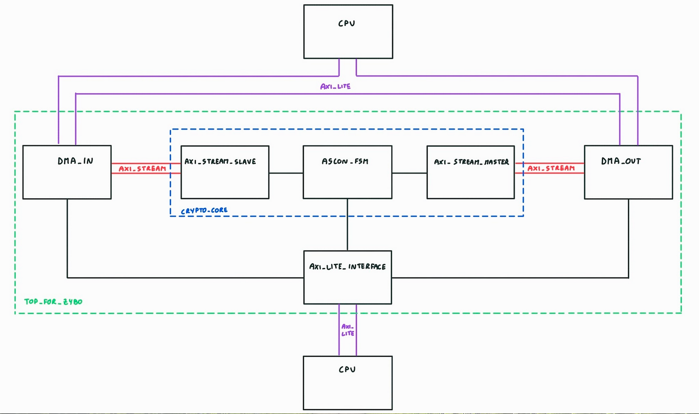

# Ascon_fsm

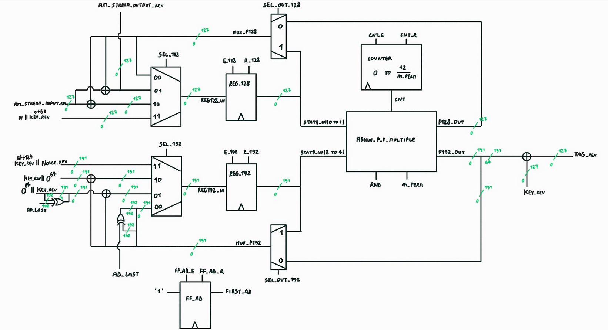

`ascon_fsm.vhd` contains the code of the actual hardware accelerator that performs the encryption, it works for `1`, `2`, `4` permutations per clock cycle, the `8` case still needs to be implemented.

## Code explanation

```
entity ASCON_fsm is
	generic( n_perm : natural := 1);
	port(		key: in std_ulogic_vector(127 downto 0);
			nonce: in std_ulogic_vector(127 downto 0);
			axi_stream_input: in std_ulogic_vector(127 downto 0);
			clk: in std_ulogic;
			rstn: in std_ulogic;
			s0_data_ack: out std_ulogic;
			s0_data_req: out std_ulogic;
			s0_new_data: in std_ulogic;
			s0_last_data: in std_ulogic;
			s0_no_data: in std_ulogic;
			m0_data_ready: in std_ulogic;
			m0_new_data : out std_ulogic;
			m0_last_data: out std_ulogic;
			tag_valid: out std_ulogic;
			tag_ready: in std_ulogic;
			tag: out std_ulogic_vector(127 downto 0);
			axi_stream_output: out std_ulogic_vector(127 downto 0)
			);
end ASCON_fsm;
```
- `n_perm` is the generic parameter controlling how many permutations per clock cycle will be performed.
- `key` and `nonce` come from the **axi_lite_interface**
- `axi_stream_input`, `s0_data_ack`, `s0_data_req`, `s0_new_data`, `s0_last_data`, `s0_no_data` come from **axi_stream_slave**
- `axi_stream_outout`, `m0_data_ready`, `m0_new_data`, `m0_last_data` go to **axi_stream_master**
- `tag`,`tag_valid`, `tag_ready` go to **axi_lite_interface**

```
begin

	key_rev <= reverse_byte(key);
	nonce_rev <= reverse_byte(nonce);
	axi_input_rev <= reverse_byte(axi_stream_input);
	tag <= reverse_byte(tag_rev);
	axi_stream_output <= reverse_byte(axi_output_rev);```

```

Inside the architecture, the inputs and outputs of ASCON_fsm get byte reversed. The input get byte reversed to perform the algorithm and the output get byte reversed to go back to the rigth notation of the results.

```
	reg_128: process(clk)
	begin
		if(clk'event and clk = '1') then
			if(r_128 = '1') then
				reg128_out <= (others => '0');
			elsif (e_128='1') then
				reg128_out <= reg128_in;
			else
				reg128_out <= reg128_out;
			end if;
		end if;
	end process reg_128;
	
	reg_192: process(clk)
	begin
		if(clk'event and clk = '1') then
			if(r_192 = '1') then
				reg192_out <= (others => '0');
			elsif (e_192 ='1') then
				reg192_out <= reg192_in;
			else
				reg192_out <= reg192_out;
			end if;
		end if;
	end process reg_192;
```

instantiation of the registers that provide the input to the ascon permutations.

```
	ff_ad: process(clk)
	begin
		if(clk'event and clk = '1') then
			if(ff_ad_r = '1') then
				first_ad <= '0';
			elsif (ff_ad_e ='1') then
				first_ad <= '1';
			end if;
		end if;
	end process ff_ad;
```

Flip flop instantiation needed to perform the pass from Initialization to Associated Data

```
	counter: process(clk)
   	begin
       	if rising_edge(clk) then
           	if (cnt_r = '1') then
               		cnt <= 0;
           	elsif (cnt_e = '1') then
			if (cnt < (12/n_perm)-1) then
				cnt <= cnt + 1;
			else
				cnt <= 0;
			end if;
           end if;
       end if;
   end process counter;
```

Instantiation of the counter that provides the proper value to the permutation block, to handle the choice of the constants of the permutation.

```
reg128_in <= 	key_rev(63 downto 0) & x"00001000808c0001" when sel_128 = "11" else 
						mux_p128 when sel_128 = "00" else
						axi_input_rev xor mux_p128 when sel_128 = "01" else
						axi_input_rev xor mux_p128 when sel_128 = "10";
	
	reg192_in <= 	nonce_rev & key_rev(127 downto 64) when sel_192 = "11" else 
						(mux_p192(191 downto 191) xor ad_last) & mux_p192(190 downto 0) when sel_192 = "00" else
						(x"0000000000000000" & key_rev) xor mux_p192 when sel_192  = "10" else
						((key_rev(127 downto 127) xor ad_last) & key_rev(126 downto 0) & x"0000000000000000") xor mux_p192 when sel_192 = "01";
```

Two 4 to 1 multiplexers used to select the value to store inside the two registers.

```
	axi_output_rev <= axi_input_rev xor mux_p128;

	tag_rev <= p192_out(191 downto 64) xor key_rev;
```

Handling of the Cyphertext and Tag output respectively.

```
	state_in(0) <= reg128_out(63 downto 0);
	state_in(1) <= reg128_out(127 downto 64);
	state_in(2) <= reg192_out(63 downto 0);
	state_in(3) <= reg192_out(127 downto 64);
	state_in(4) <= reg192_out(191 downto 128);
	
	p128_out(63 downto 0) <= state_out(0);
	p128_out(127 downto 64) <= state_out(1);
	p192_out(63 downto 0) <= state_out(2);
	p192_out(127 downto 64) <= state_out(3);
	p192_out(191 downto 128) <= state_out(4);
```

Conversion from std_ulogic_vector to ascon_state_t and viceversa, needed because both the input and output of `ascon_p_f_multiple` is ascon_state_t.

```
	mux_p128 <= 	p128_out when sel_out_128 = '0' else
			reg128_out;

	mux_p192 <=	p192_out when sel_out_192 = '0' else
			reg192_out;
```

Two 2 to 1 multiplexers that handle the case in which the output of the register is fed back to its input.

```
	permutations: process(state_in,rnd,cnt)
	begin
		state_out <= ascon_p_f_multiple(state_in,rnd,cnt,n_perm);
	end process;
```

Combinatorial circut that perform n_perm permutations, and the constant of each permutation is handled by the current value of rnd and cnt.

```
	state_trans: process (clk)
	begin
		if (rstn = '0') then
			state <= idle;
		elsif (clk'event and clk = '1') then
			case state is 
				when idle =>
					state <= init_first;
					
				when init_first =>
					state <= init;
					
				when init =>
					if (cnt = (12/n_perm) -2) then
						state <= last_init;
					else
						state <= init;
					end if;
					
				when last_init =>
					state <= ad_request;
					
				when ad_request =>
					if (s0_no_data = '0') then
						if (s0_new_data = '1') then
							if (first_ad = '1') then
								state <= ad_1_first;
							else
								state <= ad_first;
							end if;
						else
							state <= ad_request;
						end if;
					else
						state <= end_init_noad;
					end if;

				when end_init_noad =>
					state <= pl_request;
					
				when ad_1_first =>
					state <= ad;
				
				when ad_first =>
					state <= ad;
				
				when ad =>
					if (cnt = (8/n_perm) - 2) then
						if (s0_last_data = '1') then
							state <= last_ad;
						else
							state <= ad_ack;
						end if;
					else
						state <= ad;
					end if;
				
				when ad_ack =>
					state <= ad_request;
				
				when last_ad =>
					state <= pl_request;
				
				when pl_request =>
					if (s0_new_data = '1') then
						if (m0_data_ready = '1') then
							if (s0_last_data = '1') then
								state <= data_send_last;
							else
								state <= data_send;
							end if;
						else
							state <= wait1;
						end if;
					else
						state <= pl_request;
					end if;
				
				when wait1 =>
					if (m0_data_ready = '1') then
						if (s0_last_data = '1') then
							state <= data_send_last;
						else
							state <= data_send;
						end if;
					else
						state <= wait1;
					end if;
				
				when data_send =>
					state <= pl_first;
				
				when pl_first =>
					state <= pl;
				
				when pl =>
					if (cnt = (8/n_perm) - 2) then
						state <= wait_pl;
					else
						state <= pl;
					end if;
				
				when wait_pl =>
					state <= pl_request;
				
				when data_send_last =>
					state <= fin_first;
				
				when fin_first =>
					state <= fin;
				
				when fin =>
					if (cnt = (12/n_perm) - 2) then
						state <= write_t;
					else
						state <= fin;
					end if;
				
				when write_t =>
					if (tag_ready = '1') then
						state <= idle;
					else
						state <= write_t;
					end if;
				
				when others =>
					state <= idle;
				
			end case;	
		end if;
	end process;
```

Process that handles the state update of the machine.

It is supposed that once `rstn` becomes '1', then the input **key** and **nonce** are the correct ones, so the machine can start with the processing

Here is an explanation of the states of the fsm:

- **init_first** : the input of the two registers is respectively: key_rev(63 downto 0) & IV, and nonce_rev & key_rev(127 downto 64) respectively.

  the register enable is set to '1', meaning that **on the next rising edge of the clock**, the input value of the two registers will be stored and outputted.

- **init** : state in which most of the permutation rounds are handled, the register enable are set to '1', the selectors of the two 4-to-1 multiplexers are set to "00", meaning that the output of the permutation block will be fed back to the register.

  The counter enable is set to '1', meaning that the value of the cnt will be increased **on the next rising edge of the clock**.

- **last_init** : this state is entered when `cnt = (12/n_perm) - 2` so, for example, if n_perm = 1 then the state is enterd when cnt = 10.

  -1 because the first permutation round gets executed on the next rising edge after **init_first**, because  `key_rev(63 downto 0) & IV` and `nonce_rev & key_rev(127 downto 64)` will be on the output of the register and cnt will be equal to 0.

  The other -1 comes from the fact that inside the **init** state, the enable of the counter and registers gets put to '1', but only **on the next rising edge of the clock** the count will be increased and the values stored inside the registers. So, if n_perm = 1 and cnt = 10, as soon as the next rising edge of the clock happen, cnt = 11 and the input of the registers will be stored one more time.

  Basically this means that the last permutation round gets executed once the **last_init** state is entered.

  So, in total, it is necessary to subtract 2 to 12/n_perm.

  In the **last_init** state, the result of the last permutation round gets stored, `cnt_r` is set to '1', meaning that **on the next rising edge of the clock** the cnt will return to 0, and the `ff_ed_e` is set to '1', meaning that **on the next risng edge of the clock**, `first_ad` becomes '1'.

- **ad_request** : `s0_dat_req` is set to '1', meaning that the ***ascon_fsm*** is requesting data from the ***axi_stream_slave*** and `rnd` is set to 8 and it will stay like that until the end of the plaintext handling.
  The fsm is now waiting for the ***axi_stream_slave*** response, that will be composed of: `s0_no_data` and `s0_new_data`.

  If `s0_no_data` is asserted high, then it means that this is the **no associated data** case, so the state becomes **end_init_noad**.

  If `s0_no_data` is low and `s0_new_data` is asserted high, then it means that there is a 128-bit associated data word ready to be processed.

  It is still necessary to check if this is the first 128-bit associated data word that gets processed, in order to perform the last XOR operation of the initialization part, which is key_rev(127 downto 0) & x"0000000000000000" XOR mux_p192. So if first_ad is high, then the state will become **ad_1_first**.

- **end_init_noad** : There is no associated data, so the only thing left to do before processing the plaintext is to perform the last XOR operation.

  The XOR operation involves only the 192-bit part of the state, so for the 128-bit part, the 4-to-1 mux selector is set to "00", meaning loop back (and sel_out are set to '1', meaning we are not interested in the output of the permutations block.

  Instead, for the 192-bit part, the 4-to-1 mux is set to "01", and at the same time ad_last is set to '1', this will also perform the very last operation of the associated data processing ( the XOR operation on the MSB).

- **ad_1_first** : State that handles the **first** permutation block for the **first** 128-bit associated data word, this is a special case because it is still needed to perform the XOR of the 192-bit part with key_rev(127 downto 0) & x"0000000000000000".

  To do so, `sel_128` is set to "10", meaning that the (128-bit part XOR A0) is performed.

  `sel_192` is set to "01" to perform the XOR of the 192-bit part with key_rev(127 downto 0) & x"0000000000000000".

  Register enables are set high, and both `sel_out_128` and `sel_out_192` are set high, meaning that the value saved in the registers will simply be the result of the XOR operations.

  Finally, `ff_ad_r` is set to '1', meaning that `first_ad` will become '0' on the next rising_edge and this state will not be entered again until the machine returns to idle.

- **ad_first** : State that handles the  **first** permutation block for **all except the first** 128-bit associated data words, if present.

    In this case, the only operation performed is the XOR on the 128-bit part of the current saved value

- **ad** : state in which majority of the permutation rounds for the associated data are executed, same structure as **init**, but this time, the state change when `cnt = (8/n_perm) - 2`.

  It is also necessary to check the logical value of `s0_last_data`, to understand if the 128-bit associated data word that has been just processed was the last one.

  Notice that `s0_last_data` will remain high until the `s0_data_ack` is asserted high by the ***ascon_fsm***.

- **ad_ack** : once a 128-bit associated data word gets processed, ***ascon_fsm*** communicates to ***axi_stream_slave*** that it has finished and it is ready to receive another 128-bit associated data word, if present. This is done by asserting `s0_data_ack` high.

  Additionally, `cnt_r` is set high in order to reset the cnt and start over.

  It is necessary to also assert `e_128` and `e_192` high, for the same reason of **last_init**.
  
- **last_ad** : Conclusion of the associated data part, the '1' XOR MSB operation is performed, aswell as setting `s0_data_ack` and `cnt_r` to '1'.

- **pl_request** : same behavior as **ad_request**.

  It is necessary to check if a new 128-bit word is ready from the ***axi_stream_slave***, by looking at `s0_new_data`, then it is necessary to check if ***axi_stream_master*** is ready to receive a new 128-bit ciphertext word, by looking at `m0_data_ready`.

  Finally, it is necessary to check if the current 128-bit plaintext word that needs to be processed is the last one, since the algorithm handles the last part of the plaintext differently. To do so, the value of `s0_last_data` is checked.

- **wait1** : the machine enters this state in case the ***axi_stream_master*** is not ready to receive a new 128-bit ciphertext word, and it remains in this state until ***axi_stream_master*** is ready.

 - **data_send** : the machine enter this state when the current 128-bit plaintext word that is getting processed is **not** the last one. In this state, the 128-bit ciphertext word corresonding to the current 128-bit plaintext word get sent to the ***axi_stream_master***.

 - **pl_first** : similar behavior as **ad_first**.

 - **pl** : similar behavior as **ad**.

 - **wait_pl** : state needed at the end of the processing of the current 128-bit plaintext word in order to store the result of the last permutation round.

 - **data_send_last** : the machine enters this state in case the current 128-bit plaintext word that needs to be processed is the last one, in that case, it's needed to cammunicate it to the ***axi_stream_master*** by asserting `m0_last_data` high

 - **fin_first** : handling of the XOR operation that divides plaintext and finalization parts of the algorithm, and processing of the last 128-bit plaintext word

 - **fin** : state that handles the permutation rounds for the finalization, the machine stays in this state until `cnt = (12/n_perm) - 2`

 - **write_t** : once the tag is ready to be sent, the machine enters this state, and it is not leaved untill ***axi_lite_interfaces*** reads the tag.
    
  


```
	output_p: process(state)
	begin
		sel_128 <= "00";
		sel_192 <= "00";
		e_128 <= '0';
		e_192 <= '0';
		r_128 <= '0';
		r_192 <= '0';
		cnt_e <= '0';
		cnt_r <= '0';
		s0_data_req <= '0';
		s0_data_ack <= '0';
		ff_ad_r <= '0';
		ff_ad_e <= '0';
		new_data_m <= '0';
		last_data_m <= '0';
		sel_out_128 <= '0';
		sel_out_192 <= '0';
		ad_last <= '0';
		rnd <= 12;
		tag_valid <= '0';	
		m0_new_data <= '0';
		m0_last_data <= '0';

		case state is
			when idle =>
				cnt_r <= '1';
				ff_ad_r <= '1';
				r_128 <= '1';
				r_192 <= '1';
				
			when init_first =>
				sel_128 <= "11";
				sel_192 <= "11";
				e_128 <= '1';
				e_192 <= '1';
				
			when init =>
				sel_128 <= "00";
				sel_192 <= "00";
				e_128 <= '1';
				e_192 <= '1';
				cnt_e <= '1';
				
			when last_init =>
				ff_ad_e <= '1';
				cnt_r <= '1';
				e_128 <= '1';
				e_192 <= '1';
				
			when ad_request =>
				s0_data_req <= '1';
				rnd <= 8;
				
			when ad_1_first =>
				rnd <= 8;
				sel_128 <= "10";
				sel_192 <= "01";
				e_128 <= '1';
				e_192 <= '1';
				ff_ad_r <= '1';
				sel_out_128 <= '1';
				sel_out_192 <= '1';
				
			when ad_first =>
				rnd <= 8;
				sel_128 <= "10";
				sel_192 <= "00";
				e_128 <= '1';
				e_192 <= '1';
				sel_out_128 <= '1';
				sel_out_192 <= '1';
				
			when ad =>
				rnd <= 8;
				sel_128 <= "00";
				sel_192 <= "00";
				e_128 <= '1';
				e_192 <= '1';
				cnt_e <= '1';
				
			when ad_ack =>
				rnd <= 8;
				cnt_r <= '1';
				s0_data_ack <= '1';
				e_128 <= '1';
				e_192 <= '1';
				
			when last_ad =>
				rnd <= 8;
				cnt_r <= '1';
				e_128 <= '1';
				e_192 <= '1';
				s0_data_ack <= '1';
				ad_last <= '1';
				
			when pl_request =>
				rnd <= 8;
				s0_data_req <= '1';
				cnt_r <= '1';

			when end_init_noad =>
				rnd <= 8;
				sel_128 <= "00";
				sel_192 <= "01";
				e_128 <= '1';
				e_192 <= '1';
				sel_out_128 <= '1';
				sel_out_192 <= '1';
				ad_last <= '1';			
				
			when wait1 =>
				rnd <= 8;

			when data_send =>
				rnd <= 8;
				m0_new_data <= '1';
				sel_out_128 <= '1';
				sel_out_192 <= '1';
				
				
			when pl_first =>
				rnd <= 8;
				sel_128 <= "01";
				sel_192 <= "00";
				e_128 <= '1';
				e_192 <= '1';
				sel_out_128 <= '1';
				sel_out_192 <= '1';
				
			when pl =>
				rnd <= 8;
				sel_128 <= "00";
				sel_192 <= "00";
				e_128 <= '1';
				e_192 <= '1';
				cnt_e <= '1';
		
			when wait_pl =>
				rnd <= 8;
				e_128 <= '1';
				e_192 <= '1';
				
			when data_send_last =>
				rnd <= 8;
				m0_new_data <= '1';
				m0_last_data <= '1';
				cnt_r <= '1';
				sel_out_128 <= '1';
				sel_out_192 <= '1';
				
			when fin_first =>
				sel_128 <= "01";
				sel_192 <= "10";
				e_128 <= '1';
				e_192 <= '1';
				sel_out_128 <= '1';
				sel_out_192 <= '1';
				
			when fin =>
				sel_128 <= "00";
				sel_192 <= "00";
				e_128 <= '1';
				e_192 <= '1';
				cnt_e <= '1';
				
			when write_t =>
				tag_valid <= '1';
				
		end case;
	end process;
```

Process that handles the signal update.

## Flow chart of the state machine

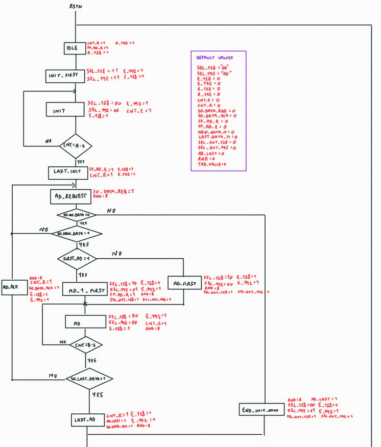
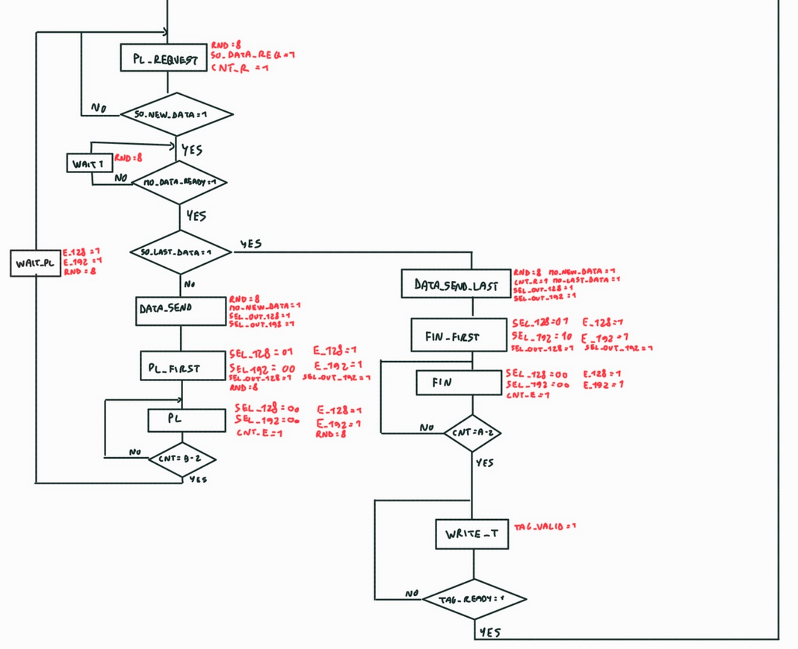

The transition between one rectangle and another ( or the same one in case of a loop) represent one clock cycle, while the conditions inside the diamonds happen instantaneously.

So, at the rising edge of the clock, the fsm updates its state, then the conditions inside the diamonds connected to the state get tested, and at the next rising edge of the clock, the state gets updated.

## Simulation of ASCON_fsm

`tb_ascon_fsm.vhd` has been used to perform a **not exhaustive** simulation of the behavior of `ascon_fsm.vhd`. It tests some possible working condition of the hardware, and it is structured as follows:

```
--------------------------------------------------------------------------------
-- to test:
-- ad: 45bc627ad055be54fa4393fed679041245bc627ad055beb5fa4397fed9790a
-- pt: feb45ab41265432cde653dfeda543f4547658136513ad436778fedc9875430

axi_stream_input <= 	x"45bc627ad055be54fa4393fed6790412" after 510 ns,
			x"45bc627ad055beb5fa4397fed9790a01" after 2000 ns, 
			x"feb45ab41265432cde653dfeda543f45" after 2500 ns,
			x"47658136513ad436778fedc987543001" after 3000 ns;

s0_new_data <= '0', '1' after 730 ns, '0' after 800 ns, '1' after 2050 ns, '0' after 2100 ns, '1' after 2550 ns, '0' after 2600 ns, '1' after 3050 ns, '0' after 3100 ns, '1' after 3550 ns;
s0_last_data <= '0', '1' after 2000 ns, '0' after 2400 ns, '1' after 3000 ns;
s0_no_data <= '0';
m0_data_ready <= '0', '1' after 2100 ns;
tag_ready <= '0', '1' after 4700 ns;


-----------------------------------------------------------------------------------
---- to test:
---- ad: no ad
---- pt: feb45ab41265432cde653dfeda543f4547658136513ad436778fedc9875430

--axi_stream_input <= 	 x"feb45ab41265432cde653dfeda543f45" after 2500 ns,
--			x"47658136513ad436778fedc987543001" after 3000 ns;

--s0_new_data <= '0', '1' after 2550 ns, '0' after 2600 ns, '1' after 3050 ns, '0' after 3100 ns, '1' after 3550 ns;
--s0_last_data <= '0', '1' after 2000 ns, '0' after 2250 ns, '1' after 3000 ns;
--s0_no_data <= '1', '0' after 240 ns;
--m0_data_ready <= '0', '1' after 2100 ns;
--tag_ready <= '0', '1' after 4700 ns;

------------------------------------------------------------------------------------
```

There are two blocks:
- by commenting the second block and un-commenting the first one, there will be a simulation running for both **ad and pl 256 bits wide**, and the timing is set in a way that allows to test 1, 2 and 4 permutations per clock cycle.
- by commenting the first block and un-commenting the second one, there will be a simulation running for the **“no ad”** case, and **pl 256 bits wide**, and the timing is set so that it only works for 4 permutations per clock cycle

When `tag_valid` is asserted to '1', then the value of **Tag** is ready in the output `tag`.

when `m0_new_data` is asserted to '1', then the current 128 bit slice of the **Cyphertext** is ready in the output `axi_stream_output`.

To run the simulation, inside the vhdl folder, compile the file and then simulate with Modelsim:

```
vcom -2008 +acc ascon_pkg.vhd
vcom -2008 +acc ascon_fsm.vhd
vcom -2008 +acc tb_ascon_fsm.vhd
vsim -voptargs="+acc" tb_ascon_fsm

```
## Simulation result

From the official python implementation:
```
key:        0xabc5472b56742bca3675cbef47956338 (16 bytes)
nonce:      0x2c66b325ae354f7804658cdfe43645af (16 bytes)
plaintext:  0xfeb45ab41265432cde653dfeda543f4547658136513ad436778fedc9875430 (31 bytes)
ass.data:   0x45bc627ad055be54fa4393fed679041245bc627ad055beb5fa4397fed9790a (31 bytes)
ciphertext: 0x2b444a01ad005f98dd48fc9a3bdf2d6d9d6195874cb802f44bb1bb16677db8 (31 bytes)
tag:        0x3951082ad157d3bea812fdc7ef90c65d (16 bytes)
received:   0xfeb45ab41265432cde653dfeda543f4547658136513ad436778fedc9875430 (31 bytes)
```
Here are the result obtained from the testbench:
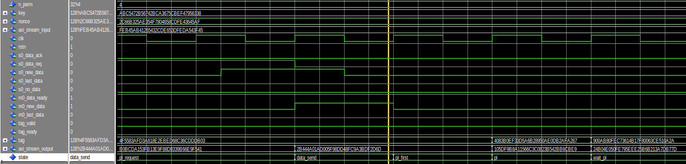
*first 128 bit slice of the ciphertext*
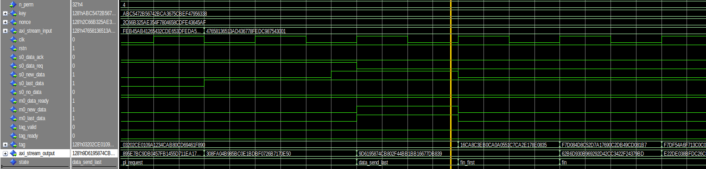
*second 128 bit slice of fthe ciphertext*
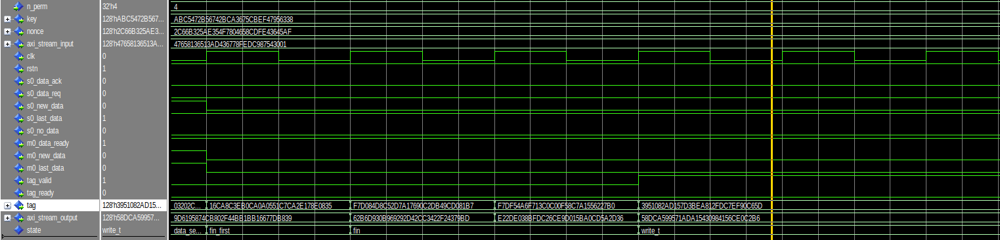
*tag result*

Once the hardware accelerator will be used on the board, in case the length of the associated data and the plaintext is not a multiple of 128 bits, their **padding will be handled entirely by software**, so it is supposed that the hardware accelerator will only receive an integer number of 128-bit words.

# Axi_stream_slave
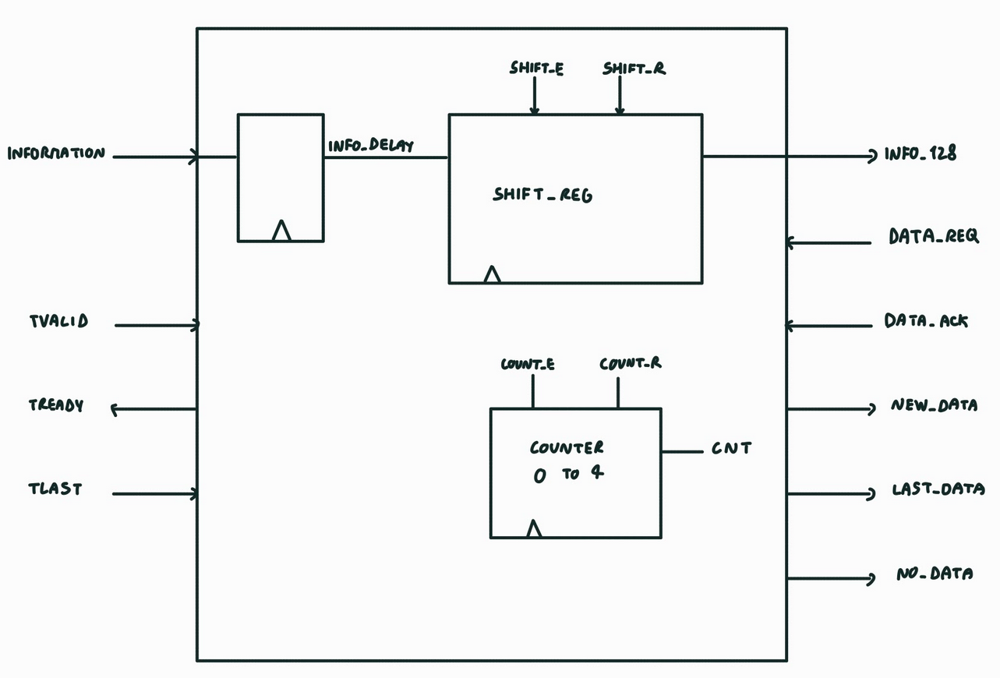


Interface that gets information (Associated data and Plaintext) from the Dma_in and provides it to Ascon_fsm.

The interface works as follows:

- From the axi stream there will be data arriving from the Dma_in in 32-bit chunks
- The 32-bit chunks get stored inside the shift_register and once 4 32-bit words arrive, a new 128-bit word is ready to be used by the Ascon_fsm, and it will be stored until Ascon_fsm requests new data through the `Data_req` signal
- Due to the way the Plaintext is handled by the algorithm, it is necessary to communicate to the Ascon_fsm which 128-bit word is the last, this is done through the `last_data` signal
- In order to handle the `no Associated data` case, if the Dma_in asserts `tlast` to '1' and it is not the **forth** 32-bit word that gets communicated, then it is considered as the `no Associated data` case 

## Code explanation

```
entity axi_stream_slave is
	port(	information: in std_ulogic_vector(31 downto 0);
		clk: in std_ulogic; 
		tvalid: in std_ulogic;
		tlast: in std_ulogic;
		data_ack: in std_ulogic;
		aresetn: in std_ulogic;
		data_req: in std_ulogic;
		info_128: out std_ulogic_vector(127 downto 0);
		new_data: out std_ulogic;
		last_data: out std_ulogic;
		tready: out std_ulogic;
		no_data: out std_ulogic
			);
end axi_stream_slave;
```
Inputs from the Dma_in and outputs to Ascon_fsm.


```
	input_reg: process(clk)
	begin
		if(clk'event and clk = '1') then
			info_delay <= information;
		end if;
	end process;

	shift_Reg: process(clk)
	begin
	  if(clk'event and clk = '1') then
			if shift_r = '1' then
				 s_out <= (others => '0');
			elsif shift_e = '1'  then
				 s_out <= info_delay & s_out(127 downto 32);
			end if;
	  end if;
	end process;

```
Istance of the shift register and the input register.


```
	counter: process(clk)
   begin
       if rising_edge(clk) then
           if (count_r = '1') then
               cnt <= 0;
           elsif (count_e = '1') then
					if (cnt < 4) then
						cnt <= cnt + 1;
					end if;
           end if;
       end if;
   end process;
	
	info_128 <= s_out;
```
Istance of the counter used to count how many 32-bit words arrive, it gets resetted after a 128-bit word gets sent to the Ascon_fsm.

```

	state_trans: process (clk)
	begin
		if (Clk'event and Clk = '1') then
			if (aresetn = '0') then
				state <= idle;
			else
				case state is
					when idle =>
						if (data_req = '1') then
							state <= ready;
						else
							state <= idle;
						end if;
						
					when ready =>
						if (tvalid = '1') then
							if (tlast = '1') then
								if ((cnt = 2 and contin = '1') or (cnt = 3 and contin = '0')) then
									state <= shift_last;
								else
									state <= no_tx;
								end if;
							else
								state <= shift;
							end if;
						else
							state <= ready;
						end if;
						
					when shift =>
						if (cnt = 3) then
							state <= send;
						else
							if (tvalid = '1') then
								if (tlast = '1') then
									if ((cnt = 2 and contin = '1') or (cnt = 3 and contin = '0')) then
										state <= shift_last;
									else
										state <= no_tx;
									end if;
								else
									state <= shift;
								end if;
							else
								state <= ready;
							end if;
						end if;
						
					when send =>
						if (data_ack = '1') then
							state <= idle;
						else
							state <= send;
						end if;
									
					when send_last =>
						if (data_ack = '1') then
							state <= idle;
						else
							state <= send_last;
						end if;
						
					when no_tx =>
						if (data_ack = '1') then
							state <= idle;
						else
							state <= no_tx;
						end if;
						
					when shift_last =>
						state <= send_last;
						
					when others =>
						state <= idle;
				end case;
			end if;
		end if;
	end process;
```
State transition process.

```

	output_p: process(state)
	begin
		new_data <= '0';
		last_data <= '0';
		count_e <= '0';
		count_r <= '0';
		shift_e <= '0';
		shift_r <= '0';
		tready <= '0';
		no_data <= '0';
		contin <= '0';

		case state is 
			when idle =>
				shift_r <= '1';
				count_r <= '1';
			when ready =>
				tready <= '1';
			when shift =>
				count_e <= '1';
				shift_e <= '1';
				tready <= '1';
				contin <= '1';
			when shift_last =>
				count_e <= '1';
				shift_e <= '1';
				tready <= '1';
			when send =>
				new_data <= '1';
			when send_last =>
				new_data <= '1';
				last_data <= '1';
			when no_tx =>
				no_data <= '1';
			
		end case;
	end process;
```
Signal update process.


## Flow chart of the state machine
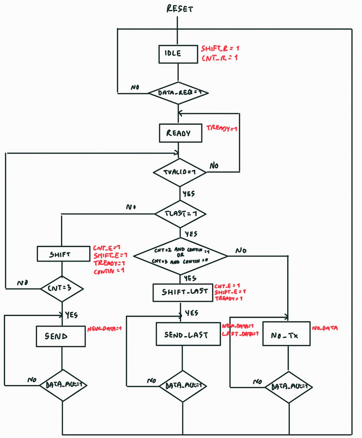


# axi_stream_master
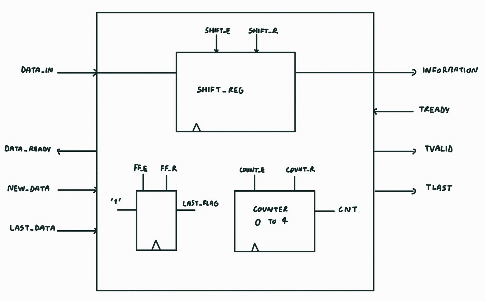

Interface that handles the communication of the ciphertext to the Dma_out.

When a new 128-bit word of the ciphertext is ready, Ascn_fsm communicates it to the axi_stream_master, and it gets stored in shift_reg once both `data_ready' and 'new_data' are asserted high.

Then, when Dma_out is ready to receive a new 32-bit word, the shift_register will output it.

When the last 128-bit word is sent from the Ascon_fsm to the axi_stream_master, `last_data` will be asserted high, and the axi_stream_interface will assert 'tlast' high during the forth 32-bit word transmission.

```
entity axi_stream_master is
	port(	info_128: in std_ulogic_vector(127 downto 0);
		new_data: in std_ulogic;
		last_data: in std_ulogic;
		tready: in std_ulogic;
		clk: in std_ulogic;
		aresetn: in std_ulogic;
		information: out std_ulogic_vector(31 downto 0);
		tvalid: out std_ulogic;
		tlast: out std_ulogic;
		data_ready: out std_ulogic
			);
end axi_stream_master;
```
Inputs from the Ascon_fsm, output to Dma_out.

```
	shift_reg:  process (clk) is
	variable temp : std_ulogic_vector(127 downto 0);
	begin
		if (clk'event and clk='1') then
			if (reg_e ='1') then
				temp := info_128;
			elsif (reg_shift ='1') then
				temp := x"00000000" & temp(127 downto 32) ;
			end if;
			information <= temp(31 downto 0);
		end if;
	end process;
```
Shift register used to store the 128-bit word coming from the Ascon_fsm.

```
	
   counter: process(clk)
   begin
       if rising_edge(clk) then
           if (count_r = '1') then
               cnt <= 0;
           elsif (count_e = '1') then
					if (cnt < 3) then
						cnt <= cnt + 1;
					end if;
           end if;
       end if;
   end process;
```
Counter used to count how many 32-bit words are sent.

```
	flipflop: process(clk)
	begin
		if(clk'event and clk = '1') then
			if ff_r= '1' then
				 last_flag <= '0';
			elsif ff_e = '1'  then
				 last_flag <= '1';
			end if;
		end if;
	end process;
```
FlipFlop to signal that the current 128-bit word is the last one.

```
	state_trans: process (clk)
	begin
		if (Clk'event and Clk = '1') then
			if (aresetn = '0') then
				state <= idle;
			else
				case state is
					when idle =>
						state <= ready;
						
					when ready =>
						if (new_data = '1') then
							if (last_data = '1') then
								state <= data_rx_last;
							else
								state <= data_rx;
							end if;
						else
							state <= ready;
						end if;
					
					when data_rx_last =>
						state <= data_valid;
					
					when data_rx =>
						state <= data_valid;
						
					when data_valid =>
						if (tready = '1') then
							state <= shift;
						else
							state <= data_valid;
						end if;
						
					when shift =>
						if (cnt = 2) then
							if (last_flag = '1') then
								state <= valid_last;
							else
								state <= valid_nolast;
							end if;
						else
							if (tready = '1') then
								state <= shift;
							else 
								state <= data_valid;
							end if;
						end if;
						
					when valid_last =>
						state <= idle;
	
					when valid_nolast =>
						state <= idle;
						
					when others =>
						state <= idle;
				end case;
			end if;
		end if;
	end process;
```
State update process.

```
	output_p: process(state)
	begin
		reg_r <= '0';
		reg_e <= '0';
		reg_shift <= '0';
		ff_r <= '0';
		ff_e <= '1';
		count_e <= '0';
		count_r <= '0';
		tvalid <= '0';
		tlast <= '0';
		data_ready <= '0';

		case state is 
			when idle =>
				reg_r <= '1';
				count_r <= '1';
				ff_r <= '1';
			when ready =>
				data_ready <= '1';
			when data_rx_last =>
				ff_e <= '1';
				reg_e <= '1';
			when data_rx =>
				reg_e <= '1';
			when data_valid =>
				tvalid <= '1';
			when shift =>
				reg_shift <= '1';
				count_e <= '1';
				tvalid <= '1';
			when valid_last =>
				tlast <= '1';
				tvalid <= '1';
			when valid_nolast =>
				tvalid <= '1';
				
		end case;
	end process;
```
Signal update process.

## Flow chart of the state machine
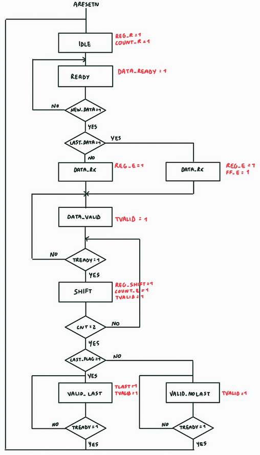

# The AXI lite control interface

The address mapping of this AXI lite control interface is the following:

| Name       | Byte offset   | Byte length | Description                     |
| :----      | :----         | :----       | :----                           |
| `KEY`      | 0-15          | 16          | Secret key                      |
| `NONCE`    | 16-31         | 16          | Nonce                           |
| `TAG`      | 32-47         | 16          | Tag                             |
| `ADDR_IN`  | 48-51         | 4           | Input starting address          |
| `LEN_IN`   | 52-55         | 4           | Input length (in 32 bits words) |
| `ADDR_OUT` | 56-59         | 4           | Output starting address         |
| `CTRL`     | 60-63         | 4           | Control register                |
| `STATUS`   | 64-67         | 4           | Status register                 |
| `-`        | 68-4095       | 4028        | Unmapped                        |

Only 4-bytes aligned accesses are supported.
Read or write accesses at unaligned addresses return a `SLVERR` response and have no other effect.
Writing the `TAG` region returns a `SLVERR` response and has no other effect.
Writing in the unmapped region returns a `DECERR` response and has no other effect.

The two Least Significant Bits (LSB) of `ADDR_IN` and `ADDR_OUT` are hard-wired to 0; writing them has no effect.
This guarantees the memory alignment of the starting addresses on 4 bytes boundaries.

The two Most Significant Bits (MSB) of `LEN_IN` are hard-wired to 0; writing them has no effect.
This guarantees a maximum input length of 4 GB.

The layout of the 32-bits CTRL register is the following:

| Name        | Bit range     | Bit width   | Description              |
| :----       | :----         | :----       | :----                    |
| `START_IN`  | 0-0           | 1           | DMA input start command  |
| `START_OUT` | 1-1           | 1           | DMA output start command |
| `-`         | 31-2          | 30          | Reserved                 |

- Writing a 1 in `START_IN` launches the input DMA if the DMA engine is available, else this has no effect.
  The flag is automatically cleared on the following rising edge of the clock.
- Writing a 1 in `START_OUT` launches the output DMA if the DMA engine is available, else this has no effect.
  The flag is automatically cleared on the following rising edge of the clock.

Writing the other bits has no effect; they read as zero.

The layout of the 32-bits STATUS register is the following:

| Name        | Bit range     | Bit width   | Description                |
| :----       | :----         | :----       | :----                      |
| `BUSY`      | 0-0           | 1           | Busy flag                  |
| `ERR_IN`    | 2-1           | 2           | Input transfer error code  |
| `ERR_OUT`   | 4-3           | 2           | Output transfer error code |
| `-`         | 31-5          | 27          | Reserved                   |

- The `BUSY` flag is automatically set to 1 when a 1 is written to `START_IN`.
  It is automatically set to 0 when an output DMA transfer ends.
- The `ERR_IN` field contains the last non-OKAY AXI read response from the memory during an input DMA transfer, or OKAY if there was no error.
- The `ERR_OUT` field contains the last non-OKAY AXI write response from the memory during an output DMA transfer, or OKAY if there was no error.

`ERR_IN` and `ERR_OUT` are cleared-on-set: when writing to `STATUS`, bits of `ERR_IN` and `ERR_OUT` are set to 0 if they are written a 1.
The other written bits are ignored.
The reserved bits read as zero.

## Simulation of the AXI lite control interface
`tb_axi_lite_interface` has been used to perform a ***non exhaustive*** simulation of the behavior of `axi_lite_interface`. The simulation is composed of a series of operations that the interface is supposed to perform, to run the simulation, inside the vhdl folder, compile the files and then simulate with Modelsim:

```
vcom -2008 +acc axi_lite_interface.vhd
vcom -2008 +acc tb_axi_lite_interface.vhd
vsim -voptargs="+acc" tb_axi_lite_interface.vhd
```
Here is the result:
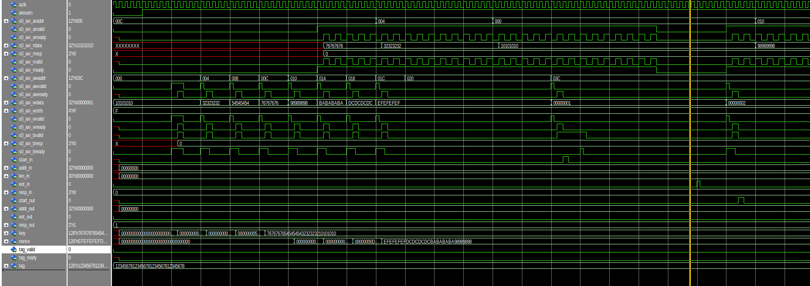


# Synthesis result
By synthesizing the 3 different architectures (1,2,4 permutations per clock cycle), The results are the following:

| Resource         | 1 perm/clk | 2 perm/clk | 4 perm/clk |
|------------------|------------|------------|------------|
| Slice LUTs       | 2455 (13.95%) | 3043 (17.29%) | 4534 (25.76%) |
| Slice Registers  | 2057          | 2056          | 2057          |

The percentages of usage suggest that the synthesizer is properly designing the permutation block because from the `1 ppc` to the `2 ppc` case, there is a percentage increment of around **3.5%**, and from `1 ppc` to `4 ppc` there is a percentage increment of around **11.5%**, following an almost linear behavior.

The `1 ppc` and `2 ppc` architectures are able to work with a 100+ Mhz clock frequency, while the maximum frequency for the `4 ppc` is estimated to be around 40 Mhz.

To run the synthesis:
```
ds=~/Desktop/ascon/ASCON NEED TO CHANGE THE PATH
syn=/tmp/$USER/ds/syn

rm -rf "$syn"/zybo
mkdir -p "$syn"/zybo
cd "$syn"/zybo
vivado -mode batch -source "$ds"/vhdl/top_for_zybo.syn.tcl -notrace

```

# ASCON on Zybo

The Zybo version of the ASCON accelerator comprises DMA engines for memory-to-crypto and crypto-to-memory transfers.
It communicates with the software stack through a AXI lite control interface used to provide a secret key and a nonce, to read out the authentication tag, to configure and control the DMA engines and to read status information.

